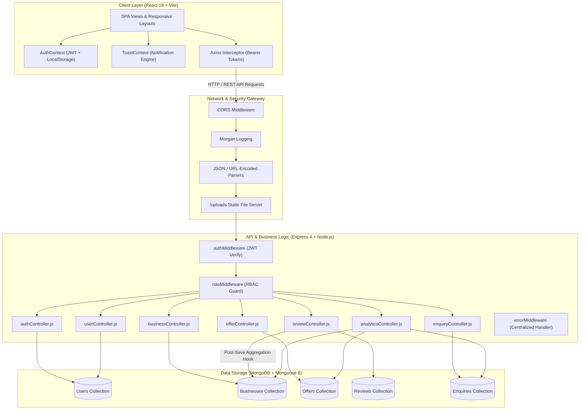
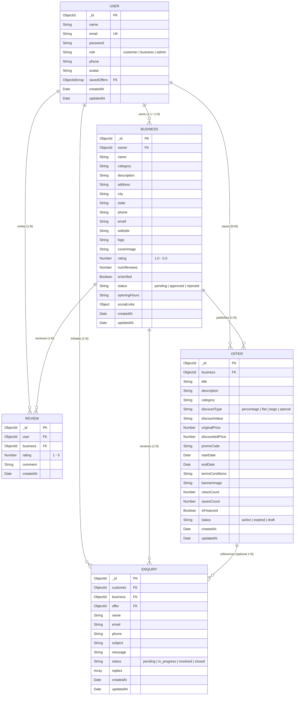
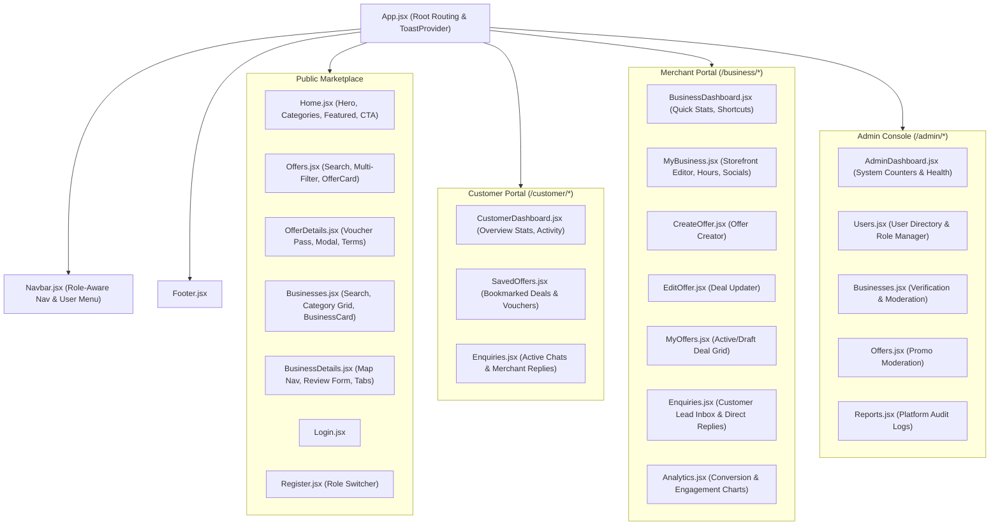

# 📐 NearNest (Locora) – Complete Technical & Architectural Blueprint

---

## 1. 🌟 Executive Summary & Platform Overview

**NearNest** is a full-stack **MERN (MongoDB, Express.js, React.js, Node.js)** hyperlocal discovery and merchant promotion platform designed to bridge the gap between neighborhood businesses and local customers across tier-2 and tier-3 cities (e.g., Vijayawada, Guntur, Tenali). 

The platform offers a three-sided ecosystem:
1. **Patrons / Customers**: Discover verified local merchants, unlock geo-located discounts/vouchers, submit reviews, and send direct enquiries.
2. **Business Owners / Merchants**: Showcase their storefronts, publish customizable promotional campaigns, respond to customer leads, and track footfall analytics.
3. **System Administrators**: Moderate platform listings, oversee registered accounts, review platform health, and ensure quality standards.

---

## 2. 🏛️ High-Level System Architecture



---

## 3. 👥 Role-Based Access Control (RBAC) Matrix

| Feature / Action | Guest (Unauthenticated) | Customer (`customer`) | Merchant (`business`) | Administrator (`admin`) |
|---|:---:|:---:|:---:|:---:|
| **Browse Stores & Search Filters** | ✅ | ✅ | ✅ | ✅ |
| **View Offer Details & Promo Codes** | ✅ | ✅ | ✅ | ✅ |
| **Save / Bookmark Deals** | ❌ | ✅ | ✅ | ✅ |
| **Submit Ratings & Reviews** | ❌ | ✅ | ❌ | ✅ (Moderate) |
| **Submit Store Enquiries** | ❌ | ✅ | ✅ | ✅ |
| **Print / Generate Digital Voucher Passes** | ✅ | ✅ | ✅ | ✅ |
| **Manage Merchant Store Profile** | ❌ | ❌ | ✅ (Own store) | ✅ (All stores) |
| **Create / Edit / Delete Offers** | ❌ | ❌ | ✅ (Own offers) | ✅ (All offers) |
| **Respond to Customer Inquiries** | ❌ | ❌ | ✅ (Own store) | ✅ |
| **View Merchant Analytics Dashboard** | ❌ | ❌ | ✅ (Own metrics) | ✅ (Global) |
| **Admin Panel & Account Management** | ❌ | ❌ | ❌ | ✅ |

---

## 4. 🗄️ Database Schema & Entity Relationships



### Schema Highlights & Hooks:
* **Review Aggregation Hook (`Review.js`)**: Automatically recalculates and updates `rating` and `numReviews` on the target `Business` document via a Mongoose post-save and post-delete aggregate pipeline.
* **Compound Uniqueness Index**: `{ business: 1, user: 1 }` on `Review` ensures each user can submit exactly one review per business.
* **Virtual Population**: `Business` model declares a virtual `offers` field populating active campaigns linked via `business._id`.

---

## 5. 🌐 API Endpoints & Contract Reference

### 🔐 Authentication (`/api/auth`)
* `POST /api/auth/register` – Register a new user (`name`, `email`, `password`, `role`, `phone`)
* `POST /api/auth/login` – Authenticate user and issue JWT
* `GET  /api/auth/me` – Retrieve current authenticated user profile *(Protected)*
* `PUT  /api/auth/profile` – Update name, phone, or avatar *(Protected)*
* `PUT  /api/auth/password` – Update user password *(Protected)*

### 🏪 Businesses (`/api/businesses`)
* `GET    /api/businesses` – Search, filter by category/city/rating, pagination
* `GET    /api/businesses/:id` – Retrieve detailed business profile with populated reviews & offers
* `POST   /api/businesses` – Register a new business storefront *(Merchant/Admin)*
* `PUT    /api/businesses/:id` – Update business information *(Owner/Admin)*
* `DELETE /api/businesses/:id` – Delete business listing *(Owner/Admin)*
* `GET    /api/businesses/owner/me` – Retrieve businesses owned by logged-in merchant *(Merchant)*

### 🏷️ Offers & Deals (`/api/offers`)
* `GET    /api/offers` – Retrieve and filter active offers (by category, discountType, city)
* `GET    /api/offers/featured` – Retrieve spotlight & featured promo banners
* `GET    /api/offers/:id` – Get offer details and increment `viewsCount`
* `POST   /api/offers` – Create a new promotional deal *(Merchant/Admin)*
* `PUT    /api/offers/:id` – Edit active promotional deal *(Merchant/Admin)*
* `DELETE /api/offers/:id` – Delete promo campaign *(Merchant/Admin)*
* `POST   /api/offers/:id/save` – Bookmark/save offer to user profile *(Customer/All)*
* `GET    /api/offers/user/saved` – Get all saved deals for current user *(Protected)*

### ⭐ Reviews & Ratings (`/api/reviews`)
* `GET    /api/reviews/business/:businessId` – Get all reviews for a business
* `POST   /api/reviews` – Submit a new 1–5 star rating and comment *(Customer/Admin)*
* `DELETE /api/reviews/:id` – Remove review and trigger rating recalculation *(Author/Admin)*

### 💬 Customer Inquiries (`/api/enquiries`)
* `POST   /api/enquiries` – Send an inquiry to a merchant *(Customer/All)*
* `GET    /api/enquiries/customer` – Get all inquiries created by current customer *(Customer)*
* `GET    /api/enquiries/business/:businessId` – Get inquiries received by a business *(Merchant)*
* `POST   /api/enquiries/:id/reply` – Append reply message to enquiry thread *(Merchant/Admin/Customer)*
* `PUT    /api/enquiries/:id/status` – Update status (`pending`, `in_progress`, `resolved`, `closed`)

### 📊 Analytics & Reporting (`/api/analytics`)
* `GET    /api/analytics/business/:businessId` – Merchant performance metrics (views, saves, inquiries)
* `GET    /api/analytics/admin` – Platform-wide totals (users, businesses, active offers, inquiries)

---

## 6. 💻 Frontend Architecture & View Hierarchy



---

## 7. 🎯 Core Interactive Workflows

### 🎟️ 1. Digital Voucher & Pass Generator
1. Customer views deal on `/offers/:id`.
2. Clicks **"Get Coupon / Pass"** modal.
3. System renders a printable barcode / QR pass with:
   - Unique generated Coupon Code (e.g., `DEAL2026-X89K`).
   - Store address, validity deadline, and discount badge.
   - One-click print / download voucher button for physical checkout.

### 🗺️ 2. One-Click Google Maps Storefront Routing
1. Merchant enters street address, city, and zip code during onboarding.
2. Patrons on `/businesses/:id` click **"Get Directions"**.
3. App constructs dynamic navigation query: `https://www.google.com/maps/search/?api=1&query={encoded_address}`.

### 💬 3. Interactive Lead Conversation Threading
1. Customer initiates inquiry from an Offer or Storefront page.
2. Inquiry is queued under the Merchant's **Enquiry Inbox** with status `pending`.
3. Merchant types a response; system appends reply with timestamp and sender role.
4. Customer receives response in their **Customer Enquiries** dashboard.

---

## 8. 🛡️ Security, Reliability & Performance Principles

* **Password Security**: Passwords hashed with `bcryptjs` using a salt work factor of 10. Passwords excluded from DB queries by default (`select: false`).
* **Stateless JWT Session**: Tokens signed with 30-day expiration, decoded and verified per request in `authMiddleware.js`.
* **Input Sanitization**: Mongoose schemas enforce data validation, regex email formats, length limits, and enum boundaries.
* **CORS & Environment Protection**: Configurable `CLIENT_URL` and environment variable segregation (`.env` omitted from source control).
* **Fault-Tolerant Seed Engine**: Comprehensive seed script (`server/seed.js`) providing instant mock data for development and live demonstration.

---

## 9. 🚀 Deployment Topology

```
┌─────────────────────────────────────────────────────────────┐
│                      DNS / Cloudflare                       │
└──────────────────────────────┬──────────────────────────────┘
                               │
               ┌───────────────┴───────────────┐
               ▼                               ▼
┌─────────────────────────────┐ ┌─────────────────────────────┐
│      Frontend Hosting       │ │       Backend Hosting       │
│     (Vercel / Netlify)      │ │   (Render / Railway / AWS)  │
│  React 18 SPA Production    │ │     Node.js + Express API   │
│         Bundle              │ │        Port: 5000 / env     │
└──────────────┬──────────────┘ └──────────────┬──────────────┘
               │                               │
               └───────────────┬───────────────┘
                               │
                               ▼
                ┌─────────────────────────────┐
                │       MongoDB Atlas         │
                │     Cloud Database Cluster  │
                │   (Automatic Backups & SSL) │
                └─────────────────────────────┘
```

---

## 10. 🔮 Roadmap & Future Enhancements

1. **Geolocation & Distance Sorting**: Integrate MongoDB `$near` geospatial indexing with HTML5 Geolocation API for real-time `"Within 5 km"` sorting.
2. **Push & SMS Alerts**: Twilio / Firebase integration for flash discount alerts to subscribed neighborhood customers.
3. **In-App QR Scanner**: Camera scanner for merchants to instantly validate and redeem customer discount vouchers.
4. **Stripe / Razorpay Integration**: In-app digital payment vouchers and featured listing sponsorships.
